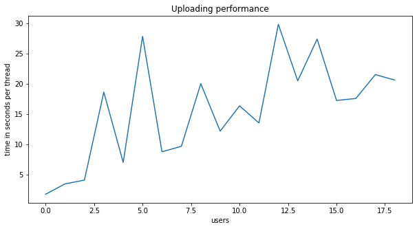

## Part 1 - Design (weighted factor for grades = 2)
### 1. Design and explain interactions between main components in your architecture of mysimbdp. (1 point)
According to the assignment, there are 3 main components in mysimbdp.

1) mysimbdp-coredms - here we store and manage our data. For this task, I chose MongoDB as a platform where my database will be located.

2) mysimbdp-daas - here we should set up APIs, which later on might be used by users to get access to stored data and also be able to both write and read data

3) mysimbdp-dataingest - this component is used to read data from the external files or databases. Also, we should be able to download data to mysimbdp-coredms by calling its' APIs

### 2. Explain how many nodes are needed in the deployment of mysimbdp-coredms so that this component can work property (theoretically based on the selected technology ) (1 point)

The amount of nodes depends mostly on the **replication factor**. In our case on a free server (M0 Free Tier), replication factor is set to 3 Nodes by default and cannot be changed. Replication factor shows how many replicas of our original database we created.

The more replicas of your database you have the more secure your data are stored. Since nodes are independent of each other, if one node breaks your database still might be supported by other nodes.

Another important factor is **sharding**. If you decided to split your data and to store it on several nodes, the amount of nodes depends on your node capacity. 

To sum up, when one chooses the number of nodes, they should think about how to save they want to store their data and also they should keep in mind the capacity of nodes they use.

### 3. Will you use VMs or containers for mysimbdp and explain the reasons for each component (1 point)

Firstly let's list some features of VMs and containers.

**VMs**

- Heavyweight
- Limited performance
- Each VM runs in its OS
- Hardware-level virtualization
- Startup time in minutes
- Allocates required memory
- Fully isolated and hence more secure

**Containers**

- Lightweight
- Native performance
- All containers share the host OS
- OS virtualization
- Startup time in milliseconds
- Requires less memory space
- Process-level isolation, possibly less secure

For current study purposes, I will go with containers for all components, since it's easy and faster to implement, plus MongoDB perfectly works with Docker.

For **mysimbdp-daas** and **mysimbdp-dataingest**, I will use Dockerized API. Since it solves most of the problems, which might arise with VMs, for instance, lack of memory (since we need to allocate memory to run VM).


### 4. Explain how would you scale mysimbdp to allow a lot of users using mysimbdp-dataingestto push data into mysimbdp (1 point)

Currently, I'm using M0 Free Tier, which put some limitations:

- Maximum of 100 operations per second
- Clusters limit the total data transferred into or out of the cluster as 10 GB per week

The way, how I will scale my database, depends on data. If I have to create a database for a small start-up in a short period, I guess it will be easy both for deployment and support to go with **vertical scaling**. It involves increasing the capacity of a single server, such as using a more powerful CPU, adding more RAM, or increasing the amount of storage space. 

But if we are speaking about Big Data, I will choose horizontal scaling. So to allow more users, to push data into **mysimbdp**, I will be using **sharding**. It is a method for distributing data across multiple machines.  MongoDB uses sharding to support deployments with very large data sets and high throughput operations.

MongoDB uses **horizontal scaling**, which involves dividing the system dataset and load over multiple servers, adding additional servers to increase capacity as required. While the overall speed or capacity of a single machine may not be high, each machine handles a subset of the overall workload, potentially providing better efficiency than a single high-speed high-capacity server. 


### 5. Explain your choice of industrial cloud infrastructure and/or mysimbdp-coredms provider, when you do not have enough infrastructural resources for provisioning mysimbdp (1 point)

Here are the pros of using MongoDB:

- It is Document oriented. It based on a collection of documents, which might have different size. That is rather logical, that different entities have different structure

- It has a high performance

- It has high availability - it supports replication, which guarantees more reliable data storage

- It has high scalability. It supports sharding and good documentation to implement it. Since we work with Big Data, it might be inevitable to use horizontal scaling

- It supports cloud distributions such as AWS

- It is good for Real-time analytics, high-speed logging and caching

- Data Representation in JSON or BSON. So it is easy to both push and download data from the database


## Part 2 - Development and deployment (weighted factor for grades = 2)

### 1. Design and explain the data schema/structure for mysimbdp-coredms (1 point)

For this project, I took Google Play Store Apps data https://www.kaggle.com/lava18/google-play-store-apps. I decided to start with a small dataset, just to try the basics of MongoDB.

In MongoDB my simpleDB cluster is devided into collections, each collection containes documents. Documents have dictionary type. Each document in the collection contains information about one app:

``` python
doc1 = {'App': 'Photo Editor & Candy Camera & Grid & ScrapBook',
 'Category': 'ART_AND_DESIGN',
 'Rating': 4.1,
 'Reviews': '159',
 'Size': '19M',
 'Installs': '10,000+',
 'Type': 'Free',
 'Price': '0',
 'Content Rating': 'Everyone',
 'Genres': 'Art & Design',
 'Last Updated': 'January 7, 2018',
 'Current Ver': '1.0.0',
 'Android Ver': '4.0.3 and up'}

```

There several ways to download data to MongoDB:

- by one document, to do this we need to use: 

``` python
# where app1 is the name of the collection where the document will be saved
app1.insert_one(doc1)

```
- by a chunk of documents:

``` python

docs = [{'App': 'Photo Editor & Candy Camera & Grid & ScrapBook',
  'Category': 'ART_AND_DESIGN',
  'Rating': 4.1,
  'Reviews': '159',
  'Size': '19M',
  'Installs': '10,000+',
  'Type': 'Free',
  'Price': '0',
  'Content Rating': 'Everyone',
  'Genres': 'Art & Design',
  'Last Updated': 'January 7, 2018',
  'Current Ver': '1.0.0',
  'Android Ver': '4.0.3 and up'},
 {'App': 'Coloring book moana',
  'Category': 'ART_AND_DESIGN',
  'Rating': 3.9,
  'Reviews': '967',
  'Size': '14M',
  'Installs': '500,000+',
  'Type': 'Free',
  'Price': '0',
  'Content Rating': 'Everyone',
  'Genres': 'Art & Design;Pretend Play',
  'Last Updated': 'January 15, 2018',
  'Current Ver': '2.0.0',
  'Android Ver': '4.0.3 and up'}]

app1.insert_many(docs)

```

### 2. Explain how would you partition the data in mysimbdp-coredms into different shards/partitions (1 point)

In my case, I won't do this, because I am on a free account. But in theory, to shard data in MongoDB, firstly, we need to set up *sharding cluster*, which has the following structure:

- *shard*: Each shard contains a subset of the sharded data. Each shard can be deployed as a replica set.

- *mongos*: The mongos acts as a query router, providing an interface between client applications and the sharded cluster.

- *config servers*: Config servers store metadata and configuration settings for the cluster. As of MongoDB 3.4, config servers must be deployed as a replica set (CSRS).

Here are general steps to shard data:

1) Create a separate database for the config server

2) Start the mongodb instance in configuration mode

3) Start the mongos instance by specifying the configuration server

4) From the mongo shell connected to the mongo's instance

5) Add all required servers to the cluster

6) Enable sharding for the database.

7) Enable sharding for the collection.

A more detailed tutorial can be found in MongoDB manual: 
https://docs.mongodb.com/manual/tutorial/deploy-shard-cluster/


### 3. Write a mysimbdp-dataingest that takes data from your selected sources and stores the data into mysimbdp-coredms (1 point)

Run mysimbdp_dataingest.ipynb to push Google Play Store Apps data https://www.kaggle.com/lava18/google-play-store-apps in MongoDB.

### 4. Given your deployment environment, show the uploading performance (response time and failure) of the tests for 1,5, 10, .., n of concurrent mysimbdp-dataingest pushing data into mysimbdp-coredms (1 point)

I used the code for multithreading from here: https://medium.com/contentsquare-engineering-blog/multithreading-vs-multiprocessing-in-python-ece023ad55a

On the figure below, you can see that the more threads (users) download data at the same time, the more time is spent on downloading of 1 thread. 




### 5. Observing the performance and failure problems when you push a lot of data into mysimbdp-coredms (you do not need to worry about duplicated data in mysimbdp), propose the change of your deployment to avoid such problems (or explain why you do not have any problem with your deployment) (1 point)

The more users simultaneously load data, the slower this data downloading in MongoDB. I guess that sharding might help here, we can download data into different servers, so that will be faster. 


